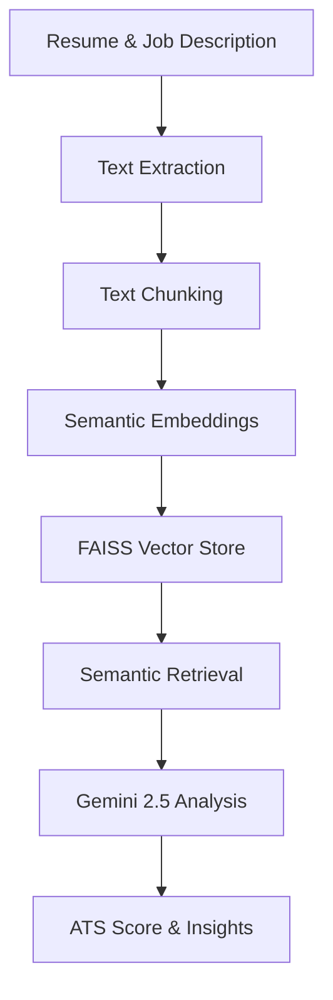

<div align="center">

# 🧠 ResumeAI
### RAG + LLM Powered Career Intelligence

[](https://www.python.org/)
[](https://flask.palletsprojects.com/)
[](https://aistudio.google.com/)
[](https://github.com/facebookresearch/faiss)
[](https://render.com)

**A high-performance AI Resume Analyzer leveraging Retrieval-Augmented Generation (RAG) and the Gemini 2.5 Flash LLM.**

Upload your resume → Get ATS scores, semantic analysis, and a personalized improvement roadmap in seconds.

[🚀 Live Demo](#) · [📖 Tech Stack](#tech-stack) · [⚙️ Local Setup](#local-setup) · [🧪 API Reference](#api-reference)

</div>

---

## ✨ Key Features

| Feature | Description |
|---|---|
| 📄 **Smart Parsing** | Automated text extraction from PDF and DOCX formats using `pdfplumber` and `python-docx`. |
| 🧬 **RAG Engine** | Semantic retrieval using `Sentence-Transformers` and `FAISS` for granular resume-to-JD matching. |
| 🤖 **Gemini 2.5 Flash** | Deep career intelligence and improvement suggestions via Google's latest high-speed LLM. |
| 📊 **ATS Analytics** | Professional scoring system blending keyword detection with high-accuracy semantic similarity. |
| 🎨 **Premium UI** | Stunning dark-mode interface with glassmorphism, Chart.js analytics, and particle animations. |
| ☁️ **Cloud Native** | Fully automated deployment logs with `render.yaml` and Gunicorn production readiness. |

---

## 🛠️ Tech Stack

- **Backend:** Flask / Python 3.11
- **LLM:** Google Gemini 2.5 Flash
- **Vector DB:** FAISS (In-memory)
- **Embeddings:** `all-MiniLM-L6-v2` (Sentence-Transformers)
- **Frontend:** Vanilla JS / CSS3 / HTML5 / Chart.js
- **Deployment:** Render.com / Gunicorn

---

## 🚀 Local Setup

### Prerequisites
- Python 3.11+
- Google Gemini API Key ([Get it here](https://aistudio.google.com/))

### Installation

```bash
# 1. Clone & Enter
git clone https://github.com/PRAVEENAYYAPPAN/ai-resume-analyzer.git
cd ai-resume-analyzer

# 2. Virtual Environment
python -m venv venv
source venv/bin/activate  # Linux/Mac
.\venv\Scripts\activate   # Windows

# 3. Dependencies
pip install -r requirements.txt

# 4. Configuration
cp .env.example .env
# Open .env and add:
# GEMINI_API_KEY=your_key_here

# 5. Run
python app.py
```

Visit `http://localhost:5000` to start analyzing.

---

## 🧬 RAG Architecture



1. **Extraction:** Resume is parsed into sections.
2. **Chunking:** Text is split into overlapping chunks for boundary-preserved context.
3. **Embeddings:** Chunks are converted into 384-dimensional vectors.
4. **FAISS:** High-speed similarity search retrieves top segments relevant to the JD.
5. **Insights:** The LLM receives retrieved context to provide factual, resume-grounded advice.

---

## 🌩️ Deployment (Render.com)

1. **Push:** Push your code to a GitHub repository.
2. **Connect:** Create a New Web Service on Render and link your repo.
3. **Settings:** Render will automatically read `render.yaml` and configure the environment.
4. **Secrets:** Add `GEMINI_API_KEY` to your Render Environment Dashboard.
5. **Success:** Your app will be live with full SSL and production-grade Gunicorn.

---

## 🛡️ Security & Privacy

- **Memory-Only Processing:** Resumes are processed as byte-streams; no data is ever persisted to disk.
- **Environment Safety:** API keys are managed strictly via `.env` and excluded from source control.
- **Validation:** Strict file-type and size (5MB) enforcement for secure uploads.

---

## 📄 License

Distributed under the **MIT License**. See `LICENSE` for more information.

---

<div align="center">
  Built with ❤️ for AI Engineers and Career Professionals
</div>
